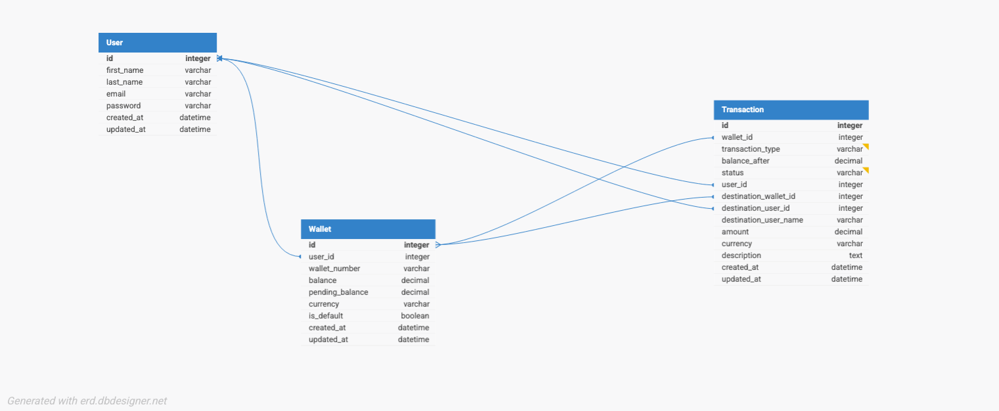

# Lendsqr Backend Test

This is a backend service for a simple wallet system.

## Getting Started

These instructions will get you a copy of the project up and running on your local machine for development and testing purposes.

### Prerequisites

- Node.js
- pnpm
- Docker

### Installing

1.  Clone the repository:
    ```bash
    git clone https://github.com/ifeanyidike/lendsqr_be_test.git
    ```
2.  Install dependencies:
    ```bash
    pnpm install
    ```
3.  Run database migrations:
    ```bash
    pnpm dev:migrate
    ```
4.  Start the development server:
    ```bash
    pnpm dev
    ```

## Docker

To run the application using Docker, use the following commands:

-   **Start the services:**
    ```bash
    docker-compose -f local.yaml up -d
    ```
-   **Stop the services:**
    ```bash
    docker-compose -f local.yaml down
    ```

## API Endpoints

### Authentication

-   **POST** `/v1/auth/signup` - Create a new user account.

    **Request Body:**

    ```json
    {
      "email": "string",
      "first_name": "string",
      "last_name": "string",
      "password": "string"
    }
    ```

-   **POST** `/v1/auth/signin` - Sign in to an existing user account.

    **Request Body:**

    ```json
    {
      "email": "string",
      "password": "string"
    }
    ```

### Users

-   **GET** `/v1/users/:id` - Get user details by ID.

### Wallet

-   **POST** `/v1/wallet/deposit` - Deposit funds into a wallet.

    **Request Body:**

    ```json
    {
      "amount": "number"
    }
    ```

-   **POST** `/v1/wallet/withdraw` - Withdraw funds from a wallet.

    **Request Body:**

    ```json
    {
      "amount": "number"
    }
    ```

-   **POST** `/v1/wallet/transfer` - Transfer funds between wallets.

    **Request Body:**

    ```json
    {
      "wallet_number": "number",
      "amount": "number",
      "description": "string"
    }
    ```

## Entity Relationship Diagram (ERD)

